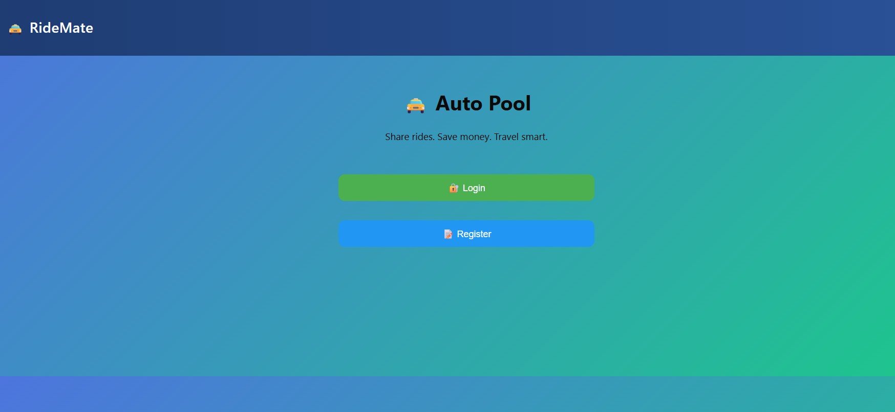
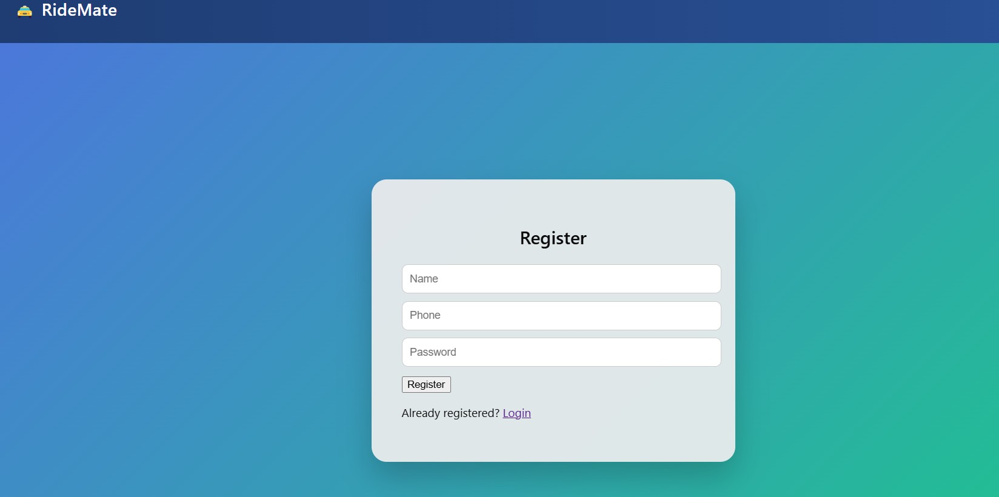
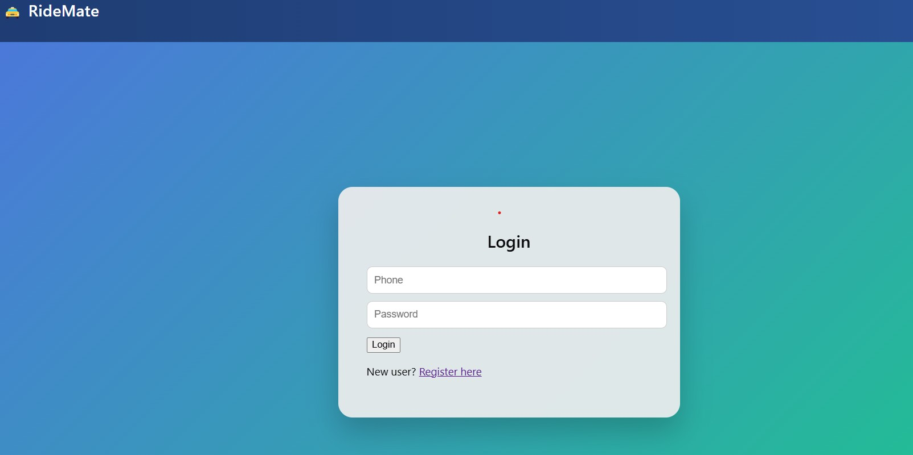
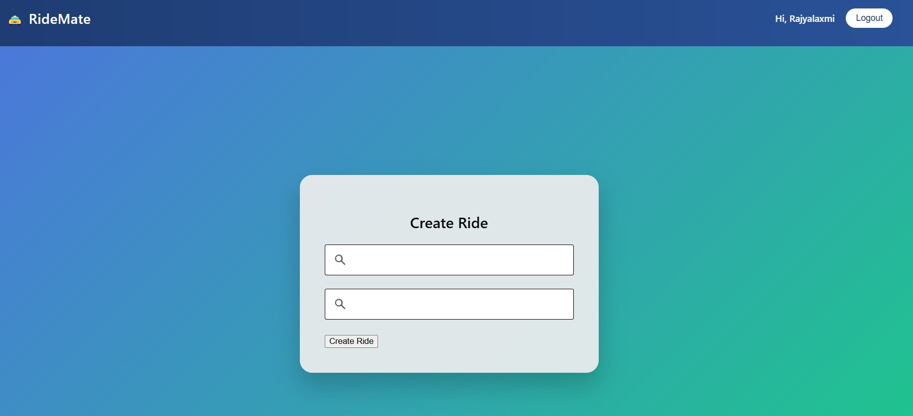
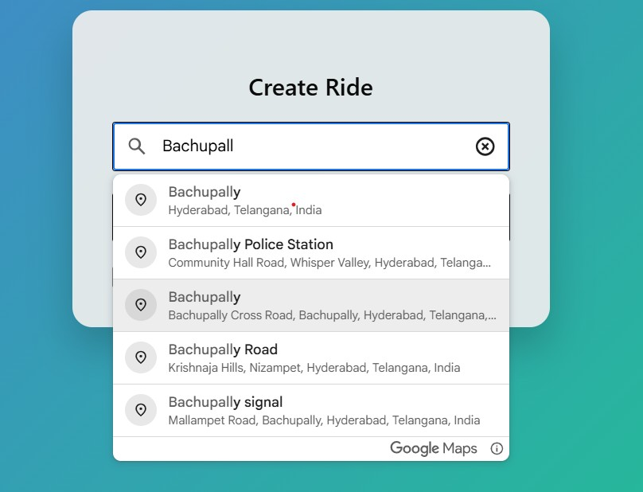
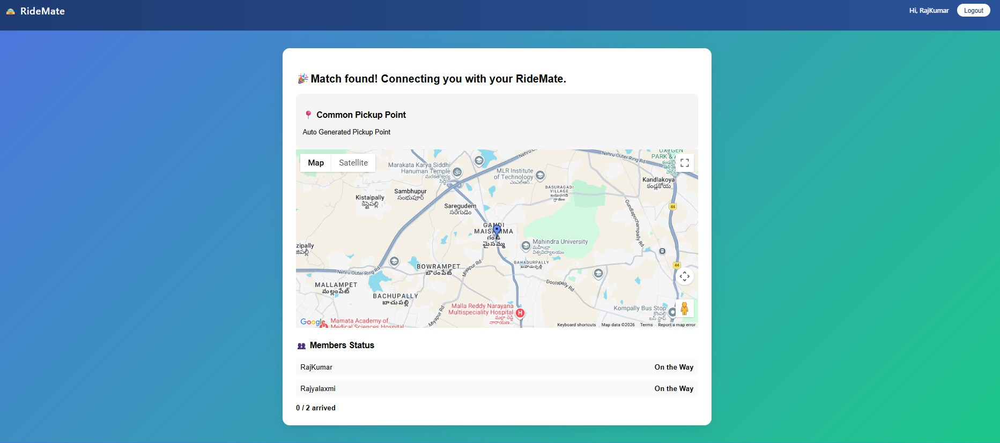

# 🚖 RideMate – Auto Ride Pooling App

RideMate is a full-stack web application that helps users share auto rides with others traveling in the same direction.  
The platform allows users to create rides, search for matching rides, and form ride groups easily using location-based suggestions.

## 🌐 Live Demo

Frontend: https://ride-mate-5.onrender.com  
Backend: https://ride-mate-4.onrender.com

## 🛠 Tech Stack

Frontend
- React
- Vite
- Axios

Backend
- Node.js
- Express.js
- MongoDB

APIs
- Google Places API
- Google Geocoding API

Deployment
- Render

##  Features

- User Authentication (Register / Login)
- Create Ride
- Join Ride
- Google Places Autocomplete for location search
- Ride matching and grouping
- Secure API handling with JWT authentication
- Deployed full-stack application

## 📸 Screenshots

### Home Page

### Register Page

### Login Page

### Create Ride

### Location Autocomplete

### Ride Match Found

## 🔐 Security

- API keys secured using environment variables
- JWT-based authentication
- Backend protected with middleware
- Google APIs restricted through Google Cloud Console

## 🚀 Future Improvements

- Real-time ride updates using WebSockets
- Map route visualization
- Seat availability tracking
- Notifications for ride matches

## 👩‍💻 Author

Bobbili Rajyalaxmi
